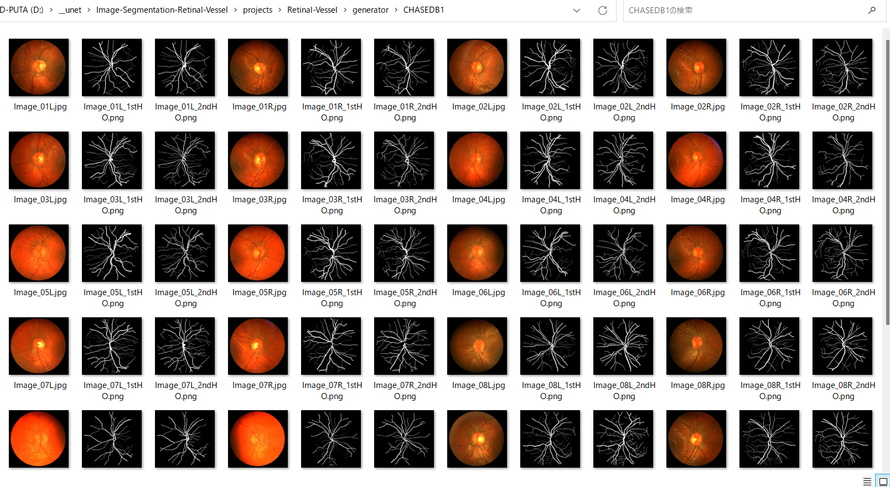
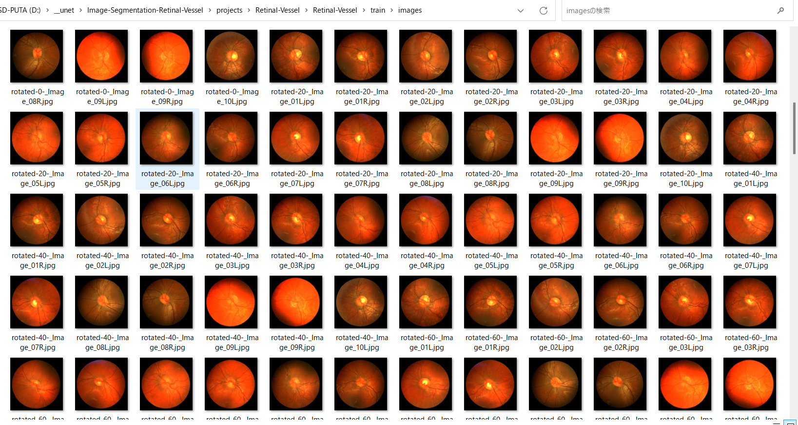
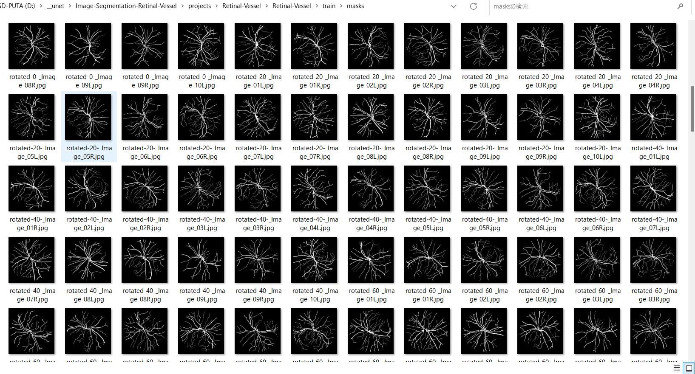
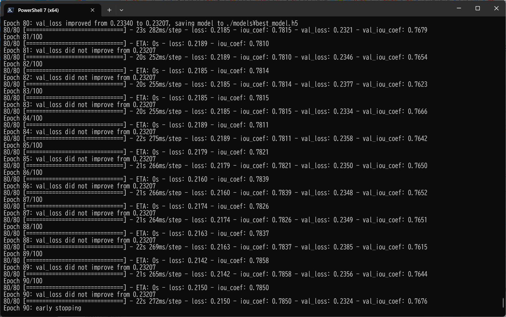
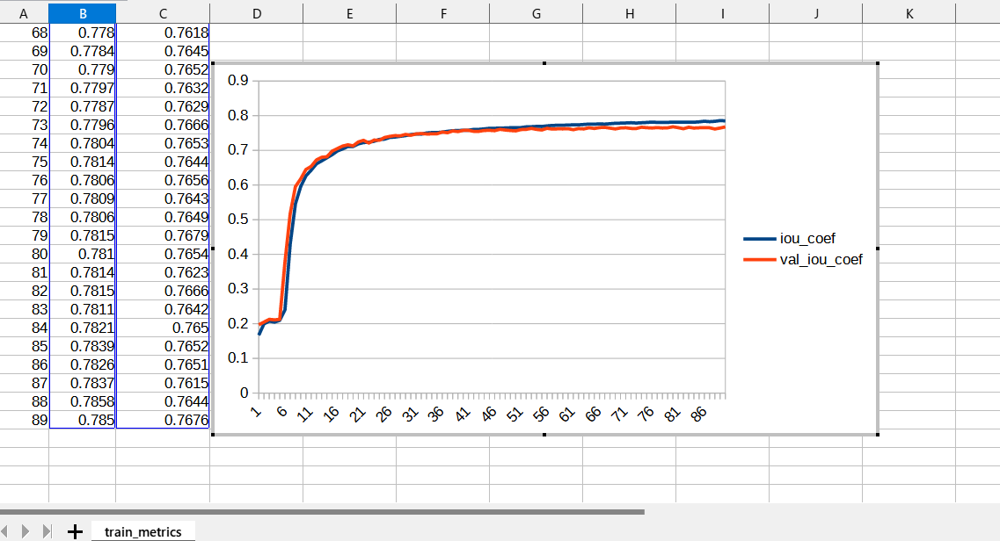
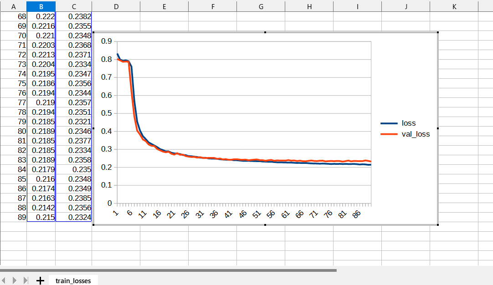
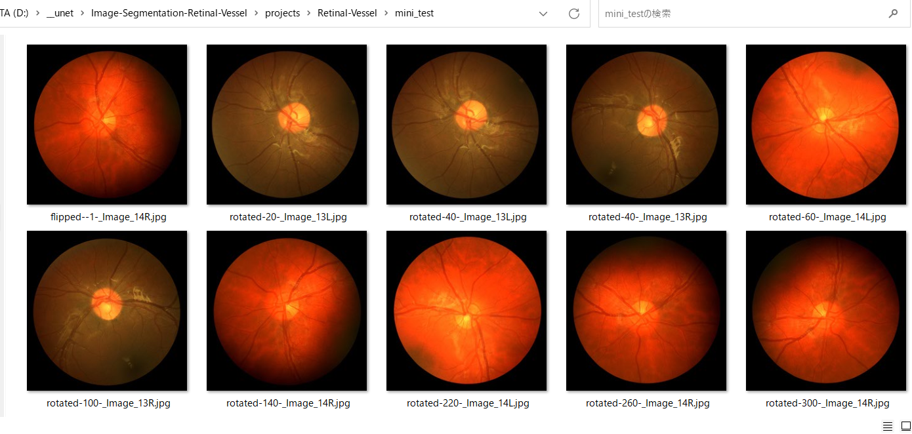
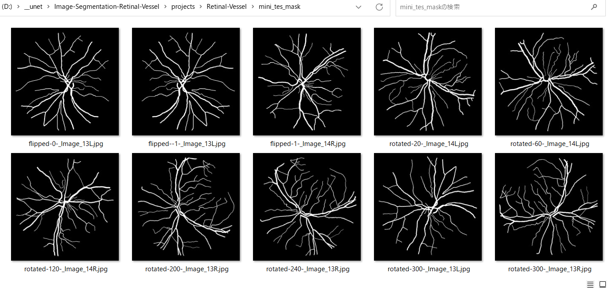
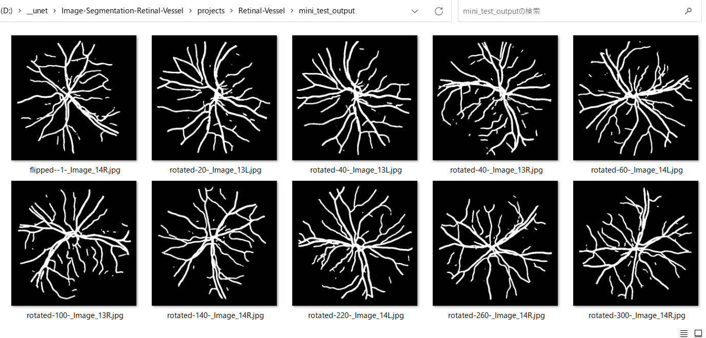
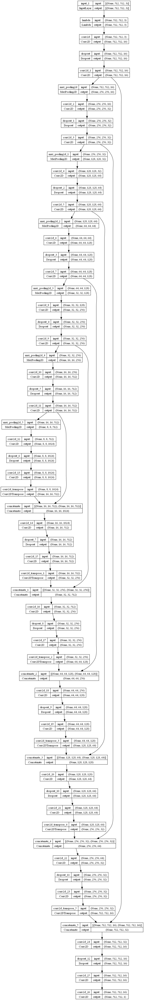

<h2>
Image-Segmentation-Retinal-Vessel (Updated: 2023/07/10)
</h2>
This is an experimental project to detect <b>Retinal-Vessel</b> by using 
a classic UNet Model <a href="https://github.com/atlan-antillia/Tensorflow-Slightly-Flexible-UNet">
Tensorflow-Slightly-Flexible-UNet.</a> 

 
 The original segmentation dataset for Retinal-Vessel has been take from the following web site 
Retinal Image Analysis 
</b>
<pre>
https://blogs.kingston.ac.uk/retinal/chasedb1/
</pre>

<h2>
1. Installing tensorflow on Windows11
</h2>
We use Python 3.8.10 to run tensoflow 2.10.1 on Windows11. 
<h3>1.1 Install Microsoft Visual Studio Community</h3>
Please install <a href="https://visualstudio.microsoft.com/ja/vs/community/">Microsoft Visual Studio Community</a>, 
which can be ITed to compile source code of 
<a href="https://github.com/cocodataset/cocoapi">cocoapi</a> for PythonAPI. 
<h3>1.2 Create a python virtualenv </h3>
Please run the following command to create a python virtualenv of name <b>py38-unet</b>.
<pre>
>cd c:\
>python38\python.exe -m venv py38-unet
>cd c:\py38-unet
>./scripts/activate
</pre>
<h3>1.3 Create a working folder </h3>
Please create a working folder "c:\google" for your repository, and install the python packages. 

<pre>
>mkdir c:\google
>cd    c:\google
>pip install cython
>git clone https://github.com/cocodataset/cocoapi
>cd cocoapi/PythonAPI
</pre>
You have to modify extra_compiler_args in setup.py in the following way:
<pre>
   extra_compile_args=[]
</pre>
<pre>
>python setup.py build_ext install
</pre>

 
<h2>
2. Installing Image-Segmentation-Retinal-Vessel
</h2>
<h3>2.1 Clone repository</h3>
Please clone Image-Segmentation-Retinal-Vessel.git in the working folder <b>c:\google</b>. 
<pre>
>git clone https://github.com/atlan-antillia/Image-Segmentation-Retinal-Vessel.git 
</pre>
You can see the following folder structure in Image-Segmentation-Retinal-Vessel of the working folder. 

<pre>
./Image-Segmentation-Retinal-Vessel
├─asset
└─projects
    └─Retinal-Vessel
        ├─eval
        ├─generator
        │  └─CHASEDB1
        ├─mini_test
        ├─mini_test_output
        ├─mini_test_output_merged
        ├─mini_tes_mask
        ├─models
        └─Retinal-Vessel
            ├─test
            │  ├─images
            │  └─masks
            ├─train
            │  ├─images
            │  └─masks
            └─valid
                ├─images
                └─masks
</pre>
<h3>2.2 Install python packages</h3>

Please run the following command to install python packages for this project. 
<pre>
>cd ./Image-Segmentation-Retinal-Vessel
>pip install -r requirements.txt
</pre>

 
<h2>3 Prepare Retinal-Vessel dataset</h2>
<h3>
3.1. Download 
</h3>
Please download original <b>CHASEDB1</b> dataset from the following link.
 
<b>
Retinal Image Analysis 
</b>
<pre>
https://blogs.kingston.ac.uk/retinal/chasedb1/
</pre>
The folder structure of the dataset is the following. 
<pre>
./CHASEDB1
  +-- Image_01L.jpg
  +-- Image_01L_1stHO.png
  +-- Image_01L_2bdHO.png
  +-- Image_01R.jpg
  +-- Image_01R_1stHO.png
  +-- Image_01R_2bdHO.png
  ...
  +-- Image_14L.jpg
  +-- Image_14L_1stHO.png
  +-- Image_14L_2bdHO.png
  +-- Image_14R.jpg
  +-- Image_14R_1stHO.png
  +-- Image_14R_2bdHO.png
</pre>
The <b>CHASEDB1</b> folder of this dataset contains the ordinary image files (Image_*.jpg) and 
two types of mask png files(*_1stHO.png and *_2ndHO.png) corresponding to each image jpg file.
Please note that it contains only 28 jpg Image files of 999x960 pixel size, which is apparently too small to use for our UNet model. 
<b>CHASEDB1 samples:</b> 

 
<h3>
3.2. Generate Retinal-Vessel Image Dataset
</h3>
 We have created Python script <a href="./projects/Retinal-Vessel/generator/512x512ImageMaskDatasetGenerator.py">512x512ImageMaskDatasetGenerator.py</a> to create images and masks dataset which may be used to train our
 TensorflowUNet model. 
 This script will perform following image processing. 
 <pre>
 1 Resize all jpg and png files in <b>CHASEDB1</b> folder to 512x512 square images.
 2 Split image and mask files in <b>CHASEDB1</b> folder into test, train, valid dataset.
 3 Rotate and flip those image files to augment the original dataset.
</pre>
For simplicity, please note that we have used the <b>2ndHO.png </b> type mask files. 

<h3>
3.3 Generated Retinal-Vessel dataset. 
</h3>
Finally, we have generated the resized (512x512) jpg files dataset below.  
<pre>
Retinal-Vessel
├─test
│  ├─images
│  └─masks
├─train
│  ├─images
│  └─masks
└─valid
    ├─images
    └─masks
</pre>

<b>train/images: samples</b> 
 
<b>train/masks: samples</b> 
 

 
<h2>
4 Train TensorflowUNet Model
</h2>
 We have trained Retinal-Vessel TensorflowUNet Model by using the following
 <b>train_eval_infer.config</b> file.  
Please move to <b>./projects/Retina-Vessel</b> directory, and run the following bat file. 
<pre>
>1.train.bat
</pre>
, which simply runs the following command. 
<pre>
>python ../../TensorflowUNetTrainer.py ./train_eval_infer.config
</pre>
, where train_eval_infer.config is the following.
<pre>
; train_eval_infer.config
; 2023/07/10 antillia.com

[model]
image_width    = 512
image_height   = 512
image_channels = 3
num_classes    = 1
base_filters   = 16
num_layers     = 7
dropout_rate   = 0.06
learning_rate  = 0.001
dilation       = (1,1)
loss           = "iou_loss"
metrics        = ["iou_coef"]
show_summary   = False

[train]
epochs        = 100
batch_size    = 4
patience      = 10
metrics       = ["iou_coef", "val_iou_coef"]
model_dir     = "./models"
eval_dir      = "./eval"
image_datapath = "./Retinal-Vessel/train/images/"
mask_datapath  = "./Retinal-Vessel/train/masks/"
create_backup  = False

[eval]
image_datapath = "./Retinal-Vessel/valid/images/"
mask_datapath  = "./Retinal-Vessel/valid/masks/"

[infer] 
images_dir    = "./mini_test" 
output_dir    = "./mini_test_output"
merged_dir    = "./mini_test_output_merged"

[mask]
blur      = True
binarize  = True
threshold = 60
</pre>

You can also specify other loss and metrics functions in the config file. 
Example: basnet_hybrid_loss(https://arxiv.org/pdf/2101.04704.pdf) 
<pre>
loss         = "basnet_hybrid_loss"
metrics      = ["dice_coef", "sensitivity", "specificity"]
</pre>
On detail of these functions, please refer to <a href="./losses.py">losses.py</a> , and 
<a href="https://github.com/shruti-jadon/Semantic-Segmentation-Loss-Functions/tree/master">Semantic-Segmentation-Loss-Functions (SemSegLoss)</a>.
 
 
<b>Train console output</b> 
 
 
<b>Train metrics line graph</b>: 
 

 
<b>Train losses line graph</b>: 
 

<!--
<h2>
4 Evaluation
</h2>
 We have evaluated prediction accuracy of our Pretrained Retinal-Vessel Model by using <b>test</b> dataset.
Please run the following bat file. 
<pre>
>2.evalute.bat
</pre>
, which simply run the following command. 
<pre>
>python ../../TensorflowUNetTrainer.py ./train_eval_infer.config
</pre>
The evaluation result of this time is the following. 
 
 
-->

<h2>
5 Inference 
</h2>
We have also tried to infer the segmented region for <b>mini_test</b> dataset, which is a very small dataset including only ten images extracted from <b>test</b> dataset,
 by using our Pretrained Retinal-Vessel Model. 
<pre>
>3.infer.bat
</pre>
, which simply runs the following command. 
<pre>
>python ../../TensorflowUNetInfer.py ./train_eval_infer.config
</pre>

<b>Input images (mini_test) </b> 
 
 
<b>Ground truth masks (mini_test_mask) </b> 
 
 
<b>Infered masks (mini_test_output)</b> 
  

<h3>
References
</h3>
<b>1. State-of-the-art retinal vessel segmentation with minimalistic models</b> 
Adrian Galdran, André Anjos, José Dolz, Hadi Chakor, Hervé Lombaert & Ismail Ben Ayed  
<pre>
https://www.nature.com/articles/s41598-022-09675-y
</pre>

<h3>Appendix</h3>
Model graph 
 
 
Model summary 
<pre>
Model: "model"
__________________________________________________________________________________________________
 Layer (type)                   Output Shape         Param #     Connected to                     
==================================================================================================
 input_1 (InputLayer)           [(None, 512, 512, 3  0           []                               
                                )]                                                                
                                                                                                  
 lambda (Lambda)                (None, 512, 512, 3)  0           ['input_1[0][0]']                
                                                                                                  
 conv2d (Conv2D)                (None, 512, 512, 16  448         ['lambda[0][0]']                 
                                )                                                                 
                                                                                                  
 dropout (Dropout)              (None, 512, 512, 16  0           ['conv2d[0][0]']                 
                                )                                                                 
                                                                                                  
 conv2d_1 (Conv2D)              (None, 512, 512, 16  2320        ['dropout[0][0]']                
                                )                                                                 
                                                                                                  
 max_pooling2d (MaxPooling2D)   (None, 256, 256, 16  0           ['conv2d_1[0][0]']               
                                )                                                                 
                                                                                                  
 conv2d_2 (Conv2D)              (None, 256, 256, 32  4640        ['max_pooling2d[0][0]']          
                                )                                                                 
                                                                                                  
 dropout_1 (Dropout)            (None, 256, 256, 32  0           ['conv2d_2[0][0]']               
                                )                                                                 
                                                                                                  
 conv2d_3 (Conv2D)              (None, 256, 256, 32  9248        ['dropout_1[0][0]']              
                                )                                                                 
                                                                                                  
 max_pooling2d_1 (MaxPooling2D)  (None, 128, 128, 32  0          ['conv2d_3[0][0]']               
                                )                                                                 
                                                                                                  
 conv2d_4 (Conv2D)              (None, 128, 128, 64  18496       ['max_pooling2d_1[0][0]']        
                                )                                                                 
                                                                                                  
 dropout_2 (Dropout)            (None, 128, 128, 64  0           ['conv2d_4[0][0]']               
                                )                                                                 
                                                                                                  
 conv2d_5 (Conv2D)              (None, 128, 128, 64  36928       ['dropout_2[0][0]']              
                                )                                                                 
                                                                                                  
 max_pooling2d_2 (MaxPooling2D)  (None, 64, 64, 64)  0           ['conv2d_5[0][0]']               
                                                                                                  
 conv2d_6 (Conv2D)              (None, 64, 64, 128)  73856       ['max_pooling2d_2[0][0]']        
                                                                                                  
 dropout_3 (Dropout)            (None, 64, 64, 128)  0           ['conv2d_6[0][0]']               
                                                                                                  
 conv2d_7 (Conv2D)              (None, 64, 64, 128)  147584      ['dropout_3[0][0]']              
                                                                                                  
 max_pooling2d_3 (MaxPooling2D)  (None, 32, 32, 128)  0          ['conv2d_7[0][0]']               
                                                                                                  
 conv2d_8 (Conv2D)              (None, 32, 32, 256)  295168      ['max_pooling2d_3[0][0]']        
                                                                                                  
 dropout_4 (Dropout)            (None, 32, 32, 256)  0           ['conv2d_8[0][0]']               
                                                                                                  
 conv2d_9 (Conv2D)              (None, 32, 32, 256)  590080      ['dropout_4[0][0]']              
                                                                                                  
 max_pooling2d_4 (MaxPooling2D)  (None, 16, 16, 256)  0          ['conv2d_9[0][0]']               
                                                                                                  
 conv2d_10 (Conv2D)             (None, 16, 16, 512)  1180160     ['max_pooling2d_4[0][0]']        
                                                                                                  
 dropout_5 (Dropout)            (None, 16, 16, 512)  0           ['conv2d_10[0][0]']              
                                                                                                  
 conv2d_11 (Conv2D)             (None, 16, 16, 512)  2359808     ['dropout_5[0][0]']              
                                                                                                  
 max_pooling2d_5 (MaxPooling2D)  (None, 8, 8, 512)   0           ['conv2d_11[0][0]']              
                                                                                                  
 conv2d_12 (Conv2D)             (None, 8, 8, 1024)   4719616     ['max_pooling2d_5[0][0]']        
                                                                                                  
 dropout_6 (Dropout)            (None, 8, 8, 1024)   0           ['conv2d_12[0][0]']              
                                                                                                  
 conv2d_13 (Conv2D)             (None, 8, 8, 1024)   9438208     ['dropout_6[0][0]']              
                                                                                                  
 conv2d_transpose (Conv2DTransp  (None, 16, 16, 512)  2097664    ['conv2d_13[0][0]']              
 ose)                                                                                             
                                                                                                  
 concatenate (Concatenate)      (None, 16, 16, 1024  0           ['conv2d_transpose[0][0]',       
                                )                                 'conv2d_11[0][0]']              
                                                                                                  
 conv2d_14 (Conv2D)             (None, 16, 16, 512)  4719104     ['concatenate[0][0]']            
                                                                                                  
 dropout_7 (Dropout)            (None, 16, 16, 512)  0           ['conv2d_14[0][0]']              
                                                                                                  
 conv2d_15 (Conv2D)             (None, 16, 16, 512)  2359808     ['dropout_7[0][0]']              
                                                                                                  
 conv2d_transpose_1 (Conv2DTran  (None, 32, 32, 256)  524544     ['conv2d_15[0][0]']              
 spose)                                                                                           
                                                                                                  
 concatenate_1 (Concatenate)    (None, 32, 32, 512)  0           ['conv2d_transpose_1[0][0]',     
                                                                  'conv2d_9[0][0]']               
                                                                                                  
 conv2d_16 (Conv2D)             (None, 32, 32, 256)  1179904     ['concatenate_1[0][0]']          
                                                                                                  
 dropout_8 (Dropout)            (None, 32, 32, 256)  0           ['conv2d_16[0][0]']              
                                                                                                  
 conv2d_17 (Conv2D)             (None, 32, 32, 256)  590080      ['dropout_8[0][0]']              
                                                                                                  
 conv2d_transpose_2 (Conv2DTran  (None, 64, 64, 128)  131200     ['conv2d_17[0][0]']              
 spose)                                                                                           
                                                                                                  
 concatenate_2 (Concatenate)    (None, 64, 64, 256)  0           ['conv2d_transpose_2[0][0]',     
                                                                  'conv2d_7[0][0]']               
                                                                                                  
 conv2d_18 (Conv2D)             (None, 64, 64, 128)  295040      ['concatenate_2[0][0]']          
                                                                                                  
 dropout_9 (Dropout)            (None, 64, 64, 128)  0           ['conv2d_18[0][0]']              
                                                                                                  
 conv2d_19 (Conv2D)             (None, 64, 64, 128)  147584      ['dropout_9[0][0]']              
                                                                                                  
 conv2d_transpose_3 (Conv2DTran  (None, 128, 128, 64  32832      ['conv2d_19[0][0]']              
 spose)                         )                                                                 
                                                                                                  
 concatenate_3 (Concatenate)    (None, 128, 128, 12  0           ['conv2d_transpose_3[0][0]',     
                                8)                                'conv2d_5[0][0]']               
                                                                                                  
 conv2d_20 (Conv2D)             (None, 128, 128, 64  73792       ['concatenate_3[0][0]']          
                                )                                                                 
                                                                                                  
 dropout_10 (Dropout)           (None, 128, 128, 64  0           ['conv2d_20[0][0]']              
                                )                                                                 
                                                                                                  
 conv2d_21 (Conv2D)             (None, 128, 128, 64  36928       ['dropout_10[0][0]']             
                                )                                                                 
                                                                                                  
 conv2d_transpose_4 (Conv2DTran  (None, 256, 256, 32  8224       ['conv2d_21[0][0]']              
 spose)                         )                                                                 
                                                                                                  
 concatenate_4 (Concatenate)    (None, 256, 256, 64  0           ['conv2d_transpose_4[0][0]',     
                                )                                 'conv2d_3[0][0]']               
                                                                                                  
 conv2d_22 (Conv2D)             (None, 256, 256, 32  18464       ['concatenate_4[0][0]']          
                                )                                                                 
                                                                                                  
 dropout_11 (Dropout)           (None, 256, 256, 32  0           ['conv2d_22[0][0]']              
                                )                                                                 
                                                                                                  
 conv2d_23 (Conv2D)             (None, 256, 256, 32  9248        ['dropout_11[0][0]']             
                                )                                                                 
                                                                                                  
 conv2d_transpose_5 (Conv2DTran  (None, 512, 512, 16  2064       ['conv2d_23[0][0]']              
 spose)                         )                                                                 
                                                                                                  
 concatenate_5 (Concatenate)    (None, 512, 512, 32  0           ['conv2d_transpose_5[0][0]',     
                                )                                 'conv2d_1[0][0]']               
                                                                                                  
 conv2d_24 (Conv2D)             (None, 512, 512, 16  4624        ['concatenate_5[0][0]']          
                                )                                                                 
                                                                                                  
 dropout_12 (Dropout)           (None, 512, 512, 16  0           ['conv2d_24[0][0]']              
                                )                                                                 
                                                                                                  
 conv2d_25 (Conv2D)             (None, 512, 512, 16  2320        ['dropout_12[0][0]']             
                                )                                                                 
                                                                                                  
 conv2d_26 (Conv2D)             (None, 512, 512, 1)  17          ['conv2d_25[0][0]']              
                                                                                                  
==================================================================================================
Total params: 31,110,001
Trainable params: 31,110,001
Non-trainable params: 0
</pre>

